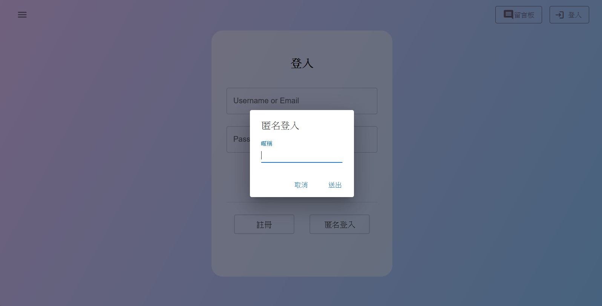

# Joe, Lin Hong-Shao Resume

## 描述

在這個專案中，我使用了「React」、「Spring Boot」、「MongoDB」進行開發，在履歷的專案中增加了登入、留言板的功能。  
登入的部分除了一般的使用帳號或郵箱登入的方法外，也提供訪客登入的功能。倘若想使用一般的登入方式的話，尚須進行註冊；
若使用訪客登入，則無需填寫帳號密碼，只需填寫暱稱即可，但若是登出，則再也無法利用該帳戶進行相關的操作。  
留言功能中，查看留言的部分可直接使用，但若是需要進行其他功能，例如：「留言查找」、「新增」、「修改」、「刪除」
，則需要登入，才能啟用。
## 成果

1. 登入
    - 登入頁面
        
    - 若無輸入任何資料就送出
        
    - 登入失敗
        
    - 訪客登入
        

2. 註冊
    - 註冊頁面
        

3. 留言板
    - 留言板。若是尚未登入，則無法使用其他功能
        
    - 留言查詢，使用一般文字查詢留言內容
        
        
    - 留言查詢，使用"@"查詢人名
        
        
    - 輸入留言
        
        
    - 修改留言，點擊修改後會直接將文字顯示於輸入框中，直接進行修改後送出即可(靈感取自於 Rocket.chat)
        
        
        
    - 刪除留言
        
        

4. 後端頁面
    - Swagger API 頁面
        

## 自我檢討www

- 留言時顯示的時間沒有更改，為 UTC+0 的時間
- Swagger API 頁面沒有更多的訊息，完全是一個很基礎的頁面
- 刪除時沒有雙重確認，單點即刪除
- 版面跑掉了(不要逼我  ಥ_ಥ )
- 還有很多可以修改的我知道
- 之前的錯字我也還沒改.........